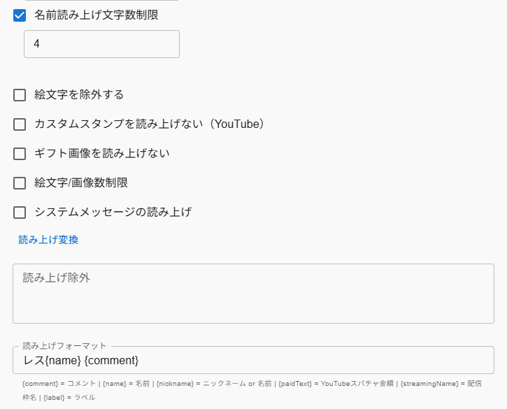

# JPNKNのレスをわんコメに送るやつ

**jpnkn の Fast インターフェイス（MQTT）で新着レスを購読し、わんコメ（OneComme）の HTTP API に自動転送する Windows トレイ常駐アプリ**

[](https://www.typescriptlang.org/)
[](https://www.electronjs.org/)
[](LICENSE)

## 📋 概要

jpnkn（jpnkn.com）の MQTT ストリームから新着レスを取得し、わんコメ（OneComme）に外部コメントとして自動投稿します。

### 主な機能

- 🔄 **リアルタイム転送**: MQTT 購読 → わんコメ HTTP API へ自動 POST
- 🎯 **外部コメント対応**: OneComme の `service: external` として挿入
- 📦 **トレイ常駐**: バックグラウンド動作、システム起動時の自動起動対応

---

## 🚀 クイックスタート

### 前提条件

- Node.js 18.x 以上（LTS 推奨）
- わんコメ（OneComme）がインストール済み
- Windows 10/11

### 開発環境での実行

```bash
# 依存パッケージをインストール
npm install

# TypeScript コンパイル + アプリ起動
npm run dev
```

トレイにアイコンが表示されたら成功です。

### 実行ファイルのビルド

```bash
# Windows portable版 (.exe) を生成
 npm run build
```

`dist/` フォルダに portable 実行ファイルが作成されます。インストール不要で、ダブルクリックで即起動できます。

---

## ⚙️ 設定方法

### 1. わんコメ（OneComme）側の準備

1. わんコメを起動
2. **右上メニュー → 設定 → API** で HTTP API を有効化
3. コメント欄を**右クリック → IDをコピー**で枠ID（Service ID）を取得
4. API エンドポイント: `http://127.0.0.1:11180`（デフォルト）

### 2. アプリの設定

トレイアイコンをクリックして設定画面を開き、以下を入力:

| 項目 | 説明 | 例 |
|------|------|-----|
| **わんコメ 枠ID（必須）** | 手順1で取得したID | `abc123-def456-...` |
| **Jpnkn Fast インターフェイス** | 購読する板ID | `mamiko` |
| **わんコメURL** | OneComme API URL | `http://127.0.0.1:11180` |
| **起動時に自動接続** | Windows起動時に自動開始 | ☑ |

設定を保存後、**Start** ボタンをクリックしてブリッジを起動します。

---

## 🔧 技術仕様

### アーキテクチャ

```
jpnkn MQTT (bbs.jpnkn.com:1883)
  ↓ 購読
[Electron Main Process]
  ↓ 変換 (src/transform.ts)
OneComme HTTP API (127.0.0.1:11180)
  ↓ POST /api/comments
わんコメに外部コメント表示
```

### 送信フォーマット

```json
{
  "service": { "id": "<枠ID>" },
  "comment": {
    "id": "jpnkn:mamiko:123456:789",
    "userId": "jpnkn:anonymous",
    "name": "名無し",
    "comment": "コメント本文"
  }
}
```

### 技術スタック

- **言語**: TypeScript 5.9
- **フレームワーク**: Electron 31.0
- **MQTT クライアント**: mqtt 5.5.0
- **HTTP クライアント**: axios 1.7.0
- **設定管理**: electron-store 9.0.0
- **テスト**: Jest 29.7.0

### プロジェクト構成

- `main.ts` - エントリーポイント
- `src/window.ts` - ウィンドウ管理
- `src/tray.ts` - トレイアイコン
- `src/bridge.ts` - MQTT接続・メッセージ処理
- `src/onecomme-client.ts` - わんコメAPI呼び出し
- `src/transform.ts` - データ変換
- `src/ipc-handlers.ts` - IPCハンドラー
- `tests/` - 単体テスト（TypeScript）
- `docs/` - 技術ドキュメント

---

## 🧪 テスト

### 単体テスト

```bash
# データ変換ロジックのテスト（全26テスト）
npm test
```

### 動作確認

1. **わんコメを起動**
2. **アプリを起動** (`npm run dev`)
3. **設定画面で入力**:
   - 板ID: `mamiko` など実在する板
   - わんコメURL: `http://127.0.0.1:11180`
   - 枠ID: わんコメで取得したID
4. **Startボタンをクリック**
5. 実際の掲示板からレスが流れ、わんコメに表示される

---

## 📚 ドキュメント

- [アーキテクチャ図・シーケンス図](docs/architecture.md)
- [jpnkn API 仕様](docs/jpnkn-api-spec.md)
- [OneComme API 仕様](docs/onecomme-api-spec.md)
- [TypeScript 移行ガイド](docs/typescript-migration.md)
- [AI 開発コンテキスト](docs/ai-context.md)

---

## 💡 Tips

### レス番号だけを読み上げさせる

このアプリはレス番号を `name`（投稿者名）フィールドとしてわんコメに送信します。わんコメの読み上げ設定を以下のように変更することで、「レス123」のように番号だけを読み上げさせることができます。

**設定箇所**: わんコメ → 設定 → 読み上げ

| 設定項目 | 値 |
|---------|-----|
| 名前読み上げ文字数制限 | ☑ オン、**4文字** |
| 読み上げフォーマット | `レス{name} {comment}` |



**なぜ4文字か**: このアプリの設定で「レス番号をプレフィックス表示」を有効にすると、`name` フィールドに `"123 名無し"` のような形式で送信されます。文字数制限を4にすると名前部分が切り捨てられ、先頭の番号（最大4桁）だけが読み上げ対象になります。

> **例**: レス番号 `123`、名前 `名無し` → `{name}` = `123 ` → 読み上げ: **「レス123」**

---

## 💡 使用上の注意

- **枠IDの取得**: わんコメの設定画面で確認できるUUID形式のIDを入力してください（例: `626f8c47-04e4-4389-b070-bf3e60f37e38`）
- **トレイ常駐**: ウィンドウを閉じてもバックグラウンドで動作します。完全終了は右クリックメニューから「終了」を選択してください

---

## 🔗 関連リンク

- [BBS.JPNKN.COM](https://bbs.jpnkn.com/) - JPNKN 掲示板
- [BBS.JPNKN.COMヘルプ](https://doc.bbs.jpnkn.com/) - BBS.JPNKN.COMヘルプ
- [わんコメ](https://onecomme.com/) - マルチコメントビューア
- [Electron](https://www.electronjs.org/) - クロスプラットフォーム デスクトップアプリフレームワーク
